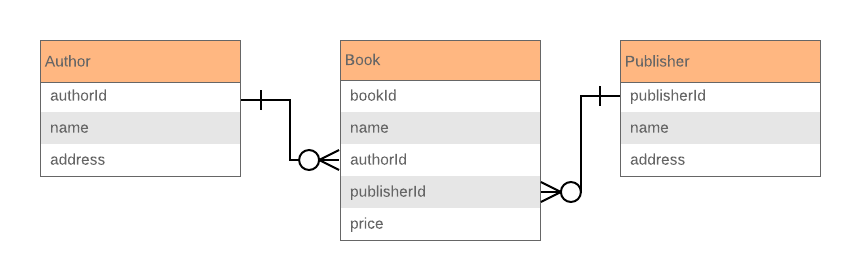
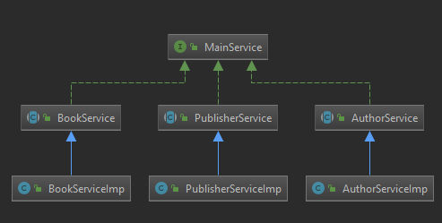

# Test programu

  - https://documenter.getpostman.com/view/9427677/TWDTLyXr
  - https://documenter.getpostman.com/view/9427677/TWDTLyXs

## Databázový model

Představme si jednoduchý scénář, kde máme autora, knížku a publisher. Autor a publisher mají relaci one-to-many s knížkami.



## JPA Entity třídy

Nadefinujeme si entity knihy, kde máme 5 atributů: id, name, author, publisher, price.

```sh
@Data
@AllArgsConstructor
@NoArgsConstructor
@Entity
@Table(name = "book")
public class Book implements Serializable {

    @Id
    @Column(name = "book_id")
    @GeneratedValue(strategy = GenerationType.IDENTITY)
    private int id;

    @NotNull
    @Column(name = "book_name")
    private String name;

    @ManyToOne(fetch = FetchType.LAZY, cascade = CascadeType.PERSIST)
    @JoinColumn(name = "author_id", nullable = false)
    Author author;

    @ManyToOne(fetch = FetchType.LAZY, cascade = CascadeType.PERSIST)
    @JoinColumn(name = "publisher_id", nullable = false)
    Publisher publisher;

    @NotNull
    @Column(name = "price")
    private double price;
}
```

Nejsou zde žádné Gettery a Settery. Vše je nastaveno pomocí pluginu “Lombok” pomocí anotace “@Data”. Konstruktory jsou nastaveny pomocí “@AllArgsConstructor ” a “@NoArgsConstructor” anotace. “@NoArgsConstructor” je potřeba pro JPA. Pozn. pomocí Lomboku dosáhneme čistého kódu.

Použitím ”@Entity” nadefinujeme třídu jako Entity class, která bude brát data z tabulky “book“ pomocí “@Table“ anotace. Id je tady nastaven jako primární klíč pomocí “@Id“ a automaticky si generuje id pomocí “@GeneratedValue“.

V Entitě “book“ může mít každý “publisher“ a “author“ více knížek, proto “book“ má relaci Many-to-One s těmito entitami. Je nastavená pomocí “@ManyToOne“ a foreign key je nadefinován v “@JoinColumn“. Zde jsem použil “Cascade.PERSIST“ pro Many-to-One relaci. To znamená, že když přidám knížku s novým autorem a publisherem, následně vymažu knížku tak autor a publisher mi zůstane uložený v databázi.

```sh
@Data
@AllArgsConstructor
@NoArgsConstructor
@Entity
@Table(name = "publisher")
public class Publisher implements Serializable {

    @Id
    @Column(name = "publisher_id")
    @GeneratedValue(strategy = GenerationType.IDENTITY)
    private int id;

    @NotNull
    @Column(name = "publisher_name")
    private String name;

    @NotNull
    @Column(name = "address")
    private String address;

    @OneToMany(mappedBy = "publisher", cascade = CascadeType.ALL)
    @JsonIgnore
    private List<Book> bookList = new ArrayList<>();
}
```

Tato entita je podobná “book“ ale má jednu metodu navíc a jiné atributy. Zde se ukládá List knih, které jsou vydávány stejným publisherem. 1 publisher může mít několik knih “@OneToMany“  relace s knihami. Aby byl publisher bidiretional použijeme “mappedBy = "publisher" “ a  “usedCascadeType.ALL“. Když bude publisher smazán, tak se smaže kniha, která patřila publisherovi.

Pro přidání nové knihy je potřeba manuálně aktualizovat bookList s relevantním autorem. Proto je tam funkce “addBook“. Stejně to uděláme pro entitu “author“.

## Vytvoření Repositories a přístup k datům z databáze

Zde používám implementaci JpaRepository interface pro vytvořené modely. Proto se musí vytvořit Interface pro všechny vytvořené modely.

```sh
@Repository
public interface AuthorRepository extends JpaRepository<Author,Integer> {
}
```
```sh
@Repository
public interface BookRepository extends JpaRepository<Book, Integer> {
}
```
```sh
@Repository
public interface PublisherRepository extends JpaRepository<Publisher, Integer> {
}
```

JPA Interface obsahuje meotdy save(), findById(), deleteById() atd.

## Vytvoření Servisní třídy

Zde se nadefinují všechny funkce, které bude používat RestController. Všechny Controllery mají CRUD funkci, která je nadefinovaná v BeanMapping, kde se vytváří servisní třídy.



```sh
public interface BeanMapping<T> {
    Page<T> getAll(Pageable pageable);
    T add(T o);
    T update(T o, int id);
    T getById(int id);
    T deleteById(int id);
}
```
```sh
public abstract class AuthorService implements BeanMapping<Author> {
    public abstract List<Book> getBookById(int id);
}
```
```sh
public abstract class BookService implements BeanMapping<Book> {
}

```
```sh
public abstract class PublisherService implements BeanMapping<Publisher> {
    public abstract List<Book> getBookById(int id);
}
```

Děděním “AuthorService“ pomocí extends nadefinujeme všechny naše metody. Je tady ještě vytvořená metoda “checkIfIdIsPresentandReturnAuthor“, která kontroluje jestli v databázi existuje hledané “id“. Jestli existuje tak se nám vrátí nějaký záznam jinak vyskčí exception. v příkladu je anotace “@Autowired“, která nám injektuje AuthorRepository objekt do service třídy. 

```sh
@Service
@SuppressWarnings("unchecked")
@NoArgsConstructor
public class AuthorServiceImpl extends AuthorService {

    @Autowired
    private AuthorRepository authorRepository;

    @Override
    public Page<Author> getAll(Pageable pageable) {
        return authorRepository.findAll(pageable);
    }

    @Override
    public Author add(Author o) {
        return authorRepository.save(o);
    }

    @Override
    public Author update(Author o, int id) {
        Author author = checkIfIdIsPresentandReturnAuthor(id);
        author.setName(author.getName());
        author.setAddress(author.getAddress());
        return authorRepository.save(author);
    }

    @Override
    public Author getById(int id) {
        return checkIfIdIsPresentandReturnAuthor(id);
    }

    @Override
    public Author deleteById(int id) {
        Author author = checkIfIdIsPresentandReturnAuthor(id);
        authorRepository.deleteById(id);
        return author;
    }


    private Author checkIfIdIsPresentandReturnAuthor( int id )
    {
        if ( !authorRepository.findById( id ).isPresent() )
            throw new ResourceNotFoundException( " Author id = " + id + " not found" );
        else
            return authorRepository.findById( id ).get();
    }

    @Override
    public List<Book> getBookById(int id) {
        return checkIfIdIsPresentandReturnAuthor(id).getBookList();
    }
}
```

Anotací @Service spring boot identifikuje jako servisní třídu. V “BookService“ může klient přidat a nebo vytvořit nového autora/publishera. Jestli klient pošle id autora/publishera na server tak by se mu měl vrátit relevantní objekt a přidá se do listu. Podobně to provedeme pro UPDATE a další funkce.

```sh
    @Override
    public Book add( Book o )
    {
        //if author n publisher gets an id we can search the db and assign them
        if ( o.getAuthor().getId() != 0 )
        {
            Author author = checkIfIdIsPresentandReturnAuthor( o.getAuthor().getId() );
            o.setAuthor( author );
            author.addBook( o );
        }
        if ( o.getPublisher().getId() != 0 )
        {
            Publisher publisher = checkIfIdIsPresentandReturnPublisher( o.getPublisher().getId() );
            o.setPublisher( publisher );
            publisher.addBook( o );
        }

        return bookRepository.save( o );
    }
```

## Vytvoření vlastního Response Wrapper

Server by měl být schopen poslat požadovanou response na základě dat, které mu příjdou.

```sh
{
 “status”: HTTP_STATUS,
 “timestamp”: SERVER_TIME,
 “data”: OBJECTS
}
```
Zde je potřeba vytvořit ResponseWrapper, který bude dědit “ResponseEntity<T>“. Prvně musím nadefinovat model, který bude ukládat JSON data. Jestli-že <T> data bude null nebo list instancí bude prázdný, vyskočí nám exception.

```sh
@Data
public class ResultSet<T> {

    private HttpStatus status;
    @JsonFormat(shape = JsonFormat.Shape.STRING, pattern = "dd-MM-yyyy hh:mm:ss")
    private LocalDateTime timestamp;
    private T data;

    private ResultSet()
    {
        this.timestamp = LocalDateTime.now();
    }

    public ResultSet( T o, HttpStatus status ) throws ResourceNotFoundException
    {
        this();
        if ( o == null || ( o instanceof List && ( ( List ) o ).isEmpty() ) )
            throw new ResourceNotFoundException( "No Content Found" );
        this.status = status;
        this.data = o;
    }
}
```

Potom můžeme nadefinovat ResponseWrapper níže.

```sh
public class ResponseWrapper<T> extends ResponseEntity<T> {

    public ResponseWrapper( T t, HttpStatus status )
    {
        super( ( T ) new ResultSet<>( t, status ), status );
    }
}
```

## Vytvoření REST kontroleru

Zde potřebujeme vytvořit REST endpointy a namapovat je do Controlleru. Uvedeme si příklad pro autora. 

```sh
GET     api/author/             - get all records with pagination
POST    api/author/             - add a new record
GET     api/author/{ID}         - get author by ID
PATCH   api/author/{ID}         - update author by ID
DELETE  api/author/{ID}         - delete author by ID
GET     api/author/{ID}/books   - get all books of author by ID
```

Níže nadefinujeme kontroler pro Autora

```sh
@Validated
@RestController
@RequestMapping("api/author")
public class AuthorController {

    @Autowired
    AuthorService authorService;

    @GetMapping(value = "/{id}")
    public ResponseWrapper<Author> getAuthorById(
            @Valid @Pattern(regexp = REGEX_FOR_NUMBERS, message = MESSAGE_FOR_REGEX_NUMBER_MISMATCH) @PathVariable(value = "id") String id )
    {
        return new ResponseWrapper<>( authorService.getById( Integer.parseInt( id ) ), HttpStatus.OK );
    }

    @GetMapping()
    public ResponseWrapper<Page<Author>> getAuthorAll(Pageable pageable )
    {
        return new ResponseWrapper<>( authorService.getAll( pageable ), HttpStatus.OK );
    }

    @PostMapping
    public ResponseWrapper<Author> createAuthor( @Valid @RequestBody Author author )
    {
        return new ResponseWrapper<>( authorService.add( author ), HttpStatus.OK );
    }

    @DeleteMapping(value = "/{id}")
    public ResponseWrapper<Author> deleteAuthor(
            @Valid @Pattern(regexp = REGEX_FOR_NUMBERS, message = MESSAGE_FOR_REGEX_NUMBER_MISMATCH) @PathVariable(value = "id") String id )
    {
        return new ResponseWrapper<>( authorService.deleteById( Integer.parseInt( id ) ), HttpStatus.OK );
    }

    @PatchMapping(value = "/{id}")
    public ResponseWrapper<Author> UpdateAuthor( @Valid @RequestBody Author author,
                                                 @Valid @Pattern(regexp = REGEX_FOR_NUMBERS, message = MESSAGE_FOR_REGEX_NUMBER_MISMATCH) @PathVariable(value = "id") String id )
    {
        return new ResponseWrapper<>( authorService.update( author, Integer.parseInt( id ) ), HttpStatus.OK );
    }

    @GetMapping(value = "/{id}/books")
    public ResponseWrapper<List<Book>> getAuthorBooksById(
            @Valid @Pattern(regexp = REGEX_FOR_NUMBERS, message = MESSAGE_FOR_REGEX_NUMBER_MISMATCH) @PathVariable(value = "id") String id )
    {
        return new ResponseWrapper<>( authorService.getBookById( Integer.parseInt( id ) ), HttpStatus.OK );
    }
}
```

Anotací “@RestController“ nastavíme třídu jako kontroler. A použitím “@RequestMapping“ nastavíme endpointy. GET pro “@GetMapping“, POST pro “@PostMapping“ atd. Použití Pageable pro GET metodu můžeme získat všechny autory následujícím způsobem:

```sh
/api/author?size=5&page=0 
```

## Exception Handling 

Exceptinony nás upozorňují na chyby ke které došlo během programu. Ve spring bootu nám vyskočí spoustu neužitečných hlášek/informací o chybě. Proto si vytvoříme vlastní kontext pro naše exceptiony. Níže je uveden náš error JSON model.

```sh
{
 “status”: “BAD_REQUEST”,
 “timestamp”: “29–03–2019 02:52:52”,
 “message”: “No Content Found”,
 “debugMessage”: “No Content Found”
}
```

K použití vlastní exceptiony potřebujeme vytvořit ExceptionHandler. Exception class a Model class se namapuji do JSON modelu.
Níže je uveden jak spring boot pracuje s exceptiony. Pokaždé, když Service vyhodí exception, tak ho RestExceptionHandler zachytí a chyba se zobrazí klientovi.


Zde je potřeba nadefinovat třídu exception handler. Použitím následujících anotací pri tuto třídu: “@ExceptionHandler“ je vstupní bod pro použití exceptiony v kontrolerech. 
Pomocí anotace “@ControllerAdvice“ můžeme používat ExceptionHandler globálně ve všech modulech.

```sh
@ControllerAdvice
public class RestExceptionHandler extends ResponseEntityExceptionHandler {

    @ExceptionHandler(ResourceNotFoundException.class)
    public ResponseEntity<Object> resourceEntityNotFound( ResourceNotFoundException ex )
    {
        ApiError apiError = createError( ex.getLocalizedMessage(), HttpStatus.BAD_REQUEST, ex );
        return new ResponseEntity<>( apiError, apiError.getHttpStatus() );
    }

    private ApiError createError( String msg, HttpStatus status, Exception e )
    {
        ApiError apiError = new ApiError( status );
        apiError.setMessage( msg );
        apiError.setDebugMessage( e.getMessage() );
        return apiError;
    }
}
```

```sh
@ResponseStatus(HttpStatus.NOT_FOUND)
public class ResourceNotFoundException extends RuntimeException{

    public ResourceNotFoundException( String exception )
    {
        super( exception );
    }
}
```

Třída “ResourceNotFoundException“ dědí z “RuntimeException“. Zde můžeme hodit “ResourceNotFoundException“ do relevantních metod a zachytit je pomocí anotace “@ExceptionHandler“ a zpracovat ji v “resourceEntityNotFound“ metodě.

## Controller Validation

představme si, že klient zadá špatný vstup. Obvykle nám spring boot vrátí prázdné tělo (response body) bez jakékoliv zprávy. Proto si musíme vytvořit vlástní chybovou hlášku.

```sh
    @GetMapping(value = "/{id}")
    public ResponseWrapper<Author> getAuthorById(
            @Valid @Pattern(regexp = REGEX_FOR_NUMBERS, message = MESSAGE_FOR_REGEX_NUMBER_MISMATCH)                         @PathVariable(value = "id") String id )
    {
        return new ResponseWrapper<>( authorService.getById( Integer.parseInt( id ) ), HttpStatus.OK );
    }
```

Pokud není číslo tak spring vyhodí “ConstrainViolationException“ exception, kterou zachytáváme ve třídě “RestExceptionHandler“.

```sh
    @ExceptionHandler(ConstraintViolationException.class)
    @ResponseStatus(value = HttpStatus.BAD_REQUEST)
    public ResponseEntity<Object> handleConstraintViolationException( ConstraintViolationException e )
    {
        ApiError apiError = createError( MESSAGE_FOR_INVALID_PARAMETERS_ERROR, HttpStatus.BAD_REQUEST, e );
        return new ResponseEntity<>( apiError, apiError.getHttpStatus() );
    }
```

Pokud klient zadá GET request “api/author/djdh22“, tak kontroler exception handler vyhodí následující chybovou hlášku zpět klientovi.

```sh
{
 “status”: “BAD_REQUEST”,
 “timestamp”: “31–03–2019 09:58:08”,
 “message”: “Invalid Parameters”,
 “debugMessage”: “getAuthorById.id: ID should contains integers only”,
 “path”: null
}
```

Pokud klient zadá POST request autora s nějakým tělem (content body), potřebujeme zkontrolovat jestli byl poslán ve správném tvaru. Proto zde použijeme anotaci “@valid“.
Pokud se pošle špatný content body, tak by se o chybovou hlášku postará “ResponseEntityExceptionHandler“ a metoda “handleMethodArgumentNotValid“.

```sh
    @Override
    @ResponseStatus(HttpStatus.BAD_REQUEST)
    protected ResponseEntity<Object> handleMethodArgumentNotValid(MethodArgumentNotValidException e,
                                                                  HttpHeaders headers, 
                                                                  HttpStatus status,                                                                                               WebRequest request )
    {
        ApiError apiError = createError( MESSAGE_FOR_INVALID_BODY_ERROR, HttpStatus.BAD_REQUEST, e );
        return new ResponseEntity<>( apiError, apiError.getHttpStatus() );
    }
```

Níže je ukázka chybové hlášky pokud se na POST request pošle špatný content body 

```sh
{
 “status”: “BAD_REQUEST”,
 “timestamp”: “01–04–2019 12:25:00”,
 “message”: “Invalid Method Body. Check JSON Objects”,
 “debugMessage”: “Validation failed for argument [0] in public me.namila.RESTSpringTest.Results.ResponseWrapper<me.namila.RESTSpringTest.Model.Author> ........ “,
 “path”: null
}
```

## Application properties

v application properties si nastavíme připojení na databázi 

```sh
## Database setting
spring.datasource.url=jdbc:postgresql://localhost:5432/book-store
spring.datasource.username=postgres
spring.datasource.password=postgres

## JPA configuration
spring.jpa.database-platform=org.hibernate.dialect.PostgreSQL9Dialect
spring.jpa.hibernate.ddl-auto=update
spring.jpa.generate-ddl=true
spring.jpa.show-sql=true
```

Zde jsem nadefinovat “spring.jpa.hibernet.ddl-auto=update“. Pokaždé kdy aplikace poběží tak se nám udělá update aktuální databáze. Je zde možnost použít create, create-drop.
